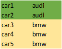
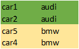
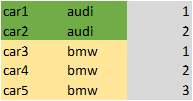
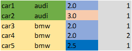

### Equalization of pandas strings

So we have to start from main solution - equal number of string by columns.
Shortly, we equalize strings by partitions and min max of count strings.

If we have unbalanced number of rows, we can equalize it, adding to the partition:

`new_df = equalize(df, columns_name = ['company','target'])`

And we get finally equal groups of data rows:

In data view we count how many audi and bmw cars we have in dataframe and then leave only minimum rows of car type:

And after:

### Row number

All famous function to create window partion sequence of raising numbers.

It implements raising number in a column of dataframe with partition which you state and sorting dataframe.

For example we'd like to make row number on car company:

`row_number(df, partition_by=['company'])`

And then we get this:

Or we'd like to make partitions by company and the type of engine:

`row_number(df, partition_by=['company','engine_type'])`

